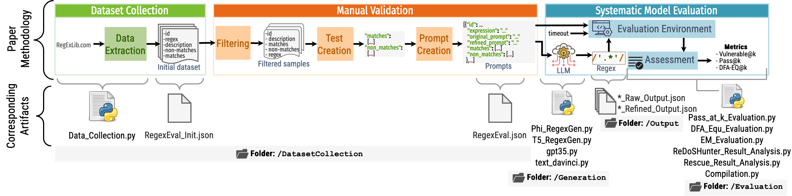

[](https://huggingface.co/datasets/s2e-lab/RegexEval)


# Re(gEx|DoS)Eval
This repository contains the source code for the paper: **Re(gEx|DoS)Eval: Evaluating Generated Regular Expressions and their Proneness to DoS Attacks**. A copy of the paper is available [here](./Miscellaneous/Paper_Preprint_Copy.pdf).

## Abstract
With the recent development of the large language model-based text and code generation, users are utilizing them for a vast range of tasks. RegEx generation is one of them. Despite the efforts of generating RegEx from natural language, there is no prompt benchmark for LLMs with real-world data and robust test sets. In addition to that, RegEx can be prone to the Denial of Service (DoS) attack because of catastrophic backtracking. Hence, we need a prompt dataset and a systemic evaluation process for the RegEx generated by the language models. We proposed Re(gEx|DoS)Eval, which includes a dataset with raw prompts from real users, refined prompts with examples, and a robust set of tests. We introduced pass@k and vulnerable@k metrics to evaluate the generated RegEx based on the functional correctness and ReDoS vulnerability. In this short paper, we demonstrated the Re(gEx|DoS)Eval with language models, i.e., T5, Phi-1.5, and GPT-3, and described the plan for the future extension of this infrastructure.
With the recent development of the large language model-based text and code generation, users are utilizing them for a vast range of tasks. RegEx generation is one of them. Despite the efforts of generating RegEx from natural language, there is no prompt benchmark for LLMs with real-world data and robust test sets. In addition to that, RegEx can be prone to the Denial of Service (DoS) attack because of catastrophic backtracking. Hence, we need a prompt dataset and a systemic evaluation process for the RegEx generated by the language models. We proposed Re(gEx|DoS)Eval, which includes a dataset with raw prompts from real users, refined prompts with examples, and a robust set of tests. We introduced pass@k and vulnerable@k metrics to evaluate the generated RegEx based on the functional correctness and ReDoS vulnerability. In this short paper, we demonstrated the Re(gEx|DoS)Eval with language models, i.e., T5, Phi-1.5, and GPT-3, and described the plan for the future extension of this infrastructure.


## Purpose
The purpose of this repository is to provide the source code for the paper: **Re(gEx|DoS)Eval: Evaluating Generated Regular Expressions and their Proneness to DoS Attacks**. We received *available* and *reusable* badges from ICSE Artifact Evaluation 2024 for this repository. 

## Usage

This project contains four folders:
 - DatasetCollection: it has the scripts to create the initial dataset of prompts and our refined dataset that has extra test cases.
 - Generation: it has the scripts we used to generate regexes from the prompts in our dataset.
 - Generation: it has the scripts we used to generate regexes from the prompts in our dataset.
 - Evaluation: it has the scripts to compute different metrics for the generated regexes.
   - ReDoSEvaluation:  it has the scripts to evaluate whether the regexes are prone to DoS attacks.


The following figure shows the methodology and the linked artifacts of this project.




In the following sections, we will describe the purpose of each folder and how to use them. 

### Installation

Run the following command to install the required packages:
```
conda create -n "redos_study"  python=3.9.4
conda activate redos_study
pip install -r requirements.txt
pip install torch==1.12.0
```

### DatasetCollection

1. Run the `Data_Collection.py` file to collect the data. Output: **RegexEval_Init.json**.
   ```
   python Data_Collection.py
   ```
2. **RegexEval.json** contains the filtered data with the additional tests and will be used in the next steps. We crafted this file *manually* by adding refined prompts and tests.

### Loading the dataset of prompts from HuggingFace

The dataset is now published on HuggingFace. You can load it as follows:

```
from datasets import load_dataset
dataset = load_dataset("s2e-lab/RegexEval")
```

### Generation
There are four Python files for four models.

You will need an OpenAI API key and have to create a **config.json** file as the **example.json** file. Update your API key in the **config.json** file.

You have to run each code twice: once for raw and once for refined prompts by passing the *raw* or *refined* in the argument. For example:

```
python T5_RegexGen.py --prompt_type raw
```

These codes will generate {Model_name}_{Prompt_type}_Output.json files. 

### Evaluation

**Compilation.py** will compile the Regexes and tests with the corresponding tests. It will generate {Model_name}_{Prompt_type}_Output_Compiled_Result.json. Then, you can run **Pass_at_k_Evaluation.py** to get the pass@k score.

**DFA_Equ_Evaluation.py** will use *regex_dfa_equals.jar* to find out the DFA match and calculate the DFA-EQ@k score.


**EM_Evaluation.py** will calculate the Exact match ratio.


### ReDoSEvaluation
**ReDoS_Dataset_Creation.py** will create text files, and every text file will contain all the generated regex line by line. It will be the input for [ReDoSHunter](https://github.com/yetingli/ReDoSHunter) and [ReScue](https://github.com/2bdenny/ReScue). Check the corresponding link about running it.

**ReDoSHunter_Result_Analysis.py** and **ReScure_Result_Analysis.py** will create the ReDoS vulnerability@k score for each model.

## Citation
If you use this code, please cite the following paper:
```
@inproceedings{siddiq2024regexeval,
  author={Siddiq, Mohammed Latif and Zhang, Jiahao and Roney, Lindsay and Santos, Joanna C. S.},
  booktitle={Proceedings of the 46th International Conference on Software Engineering, NIER Track (ICSE-NIER '24)}, 
  title={Re(gEx|DoS)Eval: Evaluating Generated Regular Expressions and their Proneness to DoS Attacks}, 
  year={2024},
  doi={10.1145/3639476.3639757}
}
